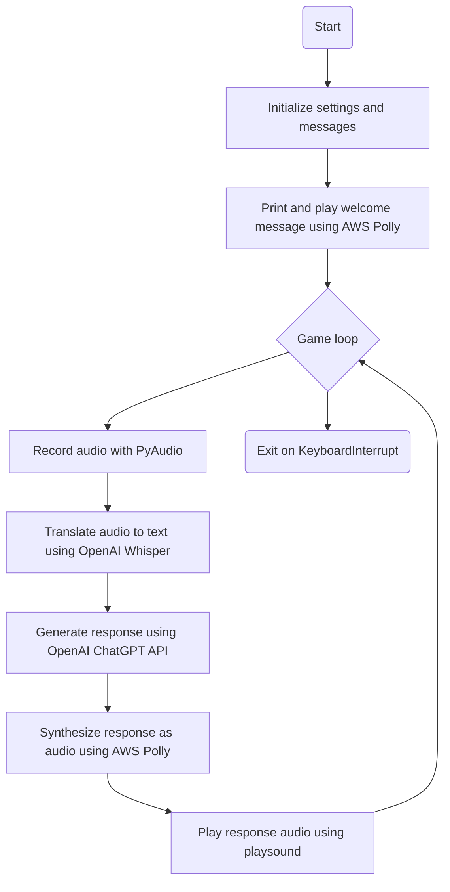

```mermaid
graph TD
A(Start) --> B[Initialize settings and messages]
B --> C[Print and play welcome message using AWS Polly]
C --> D{Game loop}
D --> E[Record audio with PyAudio]
E --> F[Translate audio to text using OpenAI Whisper]
F --> G[Generate response using OpenAI ChatGPT API]
G --> H[Synthesize response as audio using AWS Polly]
H --> I[Play response audio using playsound]
I --> D
D --> J(Exit on KeyboardInterrupt)
```
